# Kwentapp

> **Kwento + App** — *kwento* is Tagalog for story. A mobile-first blog and forum where anyone can read, and signed-in users write, discuss, and manage their own kwento.

**▶ Live demo: [jamydevph.github.io/KwentAppFlutter](https://jamydevph.github.io/KwentAppFlutter/)**
**Design:** [Figma — Kwentapp Mobile App Design](https://www.figma.com/design/yaGYztcalvGZnX8T6ReTRM/Kwentapp-%E2%80%94-Mobile-App-Design) — Design System frame plus six 390×844 screens in user-flow order

Flutter (Web + Android) · Dart · **Provider** · **go_router** · **Supabase** (Auth · Postgres + RLS · Storage) · **MVVM**

> Mobile-first at 390×844, shipped as Flutter Web and rendered in a centred column on wide screens. Browse the feed and open any post without an account; writing, commenting, and the profile require sign-in.

## Screenshots

Captured on an Android emulator with sample content, in both light and dark.

### The app, in both themes

| | Light | Dark |
|---|---|---|
| **Feed** — paginated post cards: author, multi-image preview with a **+N** overflow badge, comment count | 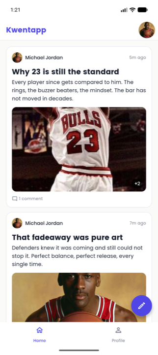 | 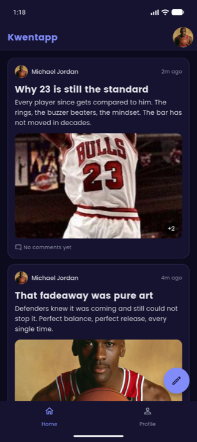 |
| **Post detail** — swipeable image gallery with page dots, and the comment thread with Edit / Delete on your own comment | 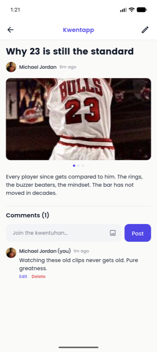 | 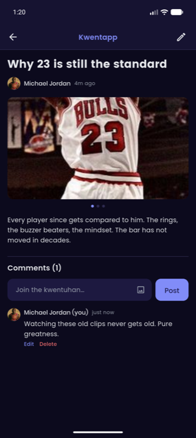 |
| **Post editor** — one page for create and edit: title, story, up to six images | 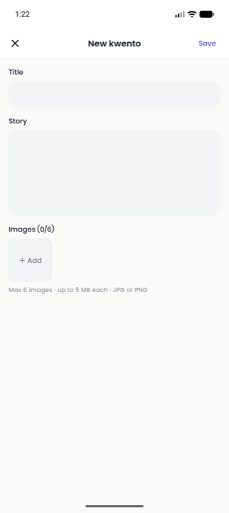 | 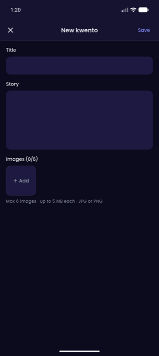 |
| **Profile** — avatar change / remove, name, read-only email, and the flow's only exit: log out | 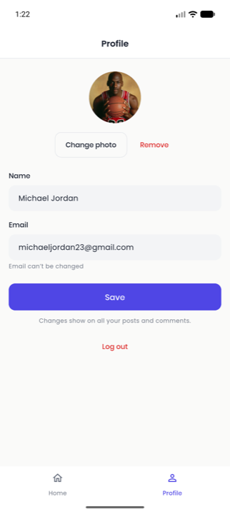 | 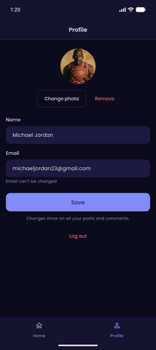 |

Light and dark are one `_build()` with swapped tokens; the app follows the system setting.

### Public browsing and auth

| Public feed — signed out | Login | Register |
|---|---|---|
| 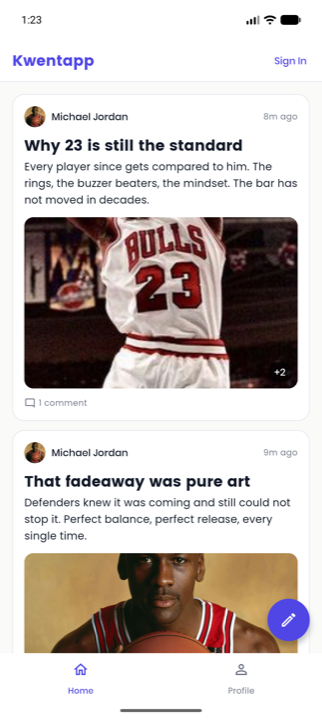 | 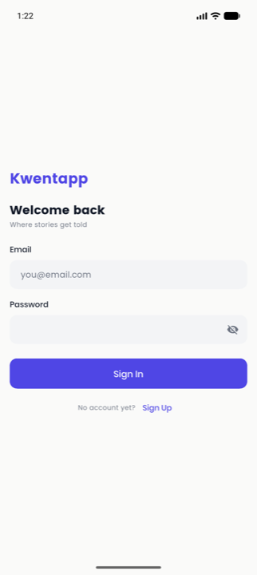 | 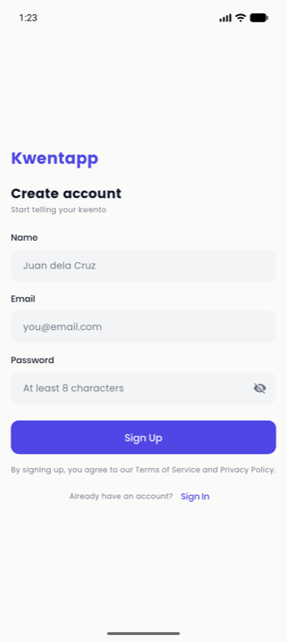 |
| Anyone can read the feed and open a post; the bar shows **Sign In** instead of an avatar, and writing redirects here | Errors surface as an inline banner, not a dialog | **No confirm-password field** — per the assessment spec |

---

## What it does

| Requirement | Status | Where |
|---|---|---|
| Register — email + password only, no confirm-password field | ✅ | `ui/auth/register/` |
| Login / logout | ✅ | `ui/auth/login/`, `ui/profile/` |
| Public post listing, multi-image previews, **paginated, visible logged out** | ✅ | `ui/feed/` |
| Create post with multiple images | ✅ | `ui/post_editor/` |
| View post with images | ✅ | `ui/post_detail/` |
| Update post — add and delete individual images | ✅ | `ui/post_editor/` |
| Delete post | ✅ | `ui/post_editor/` |
| Comments — add, edit, delete, each with multiple images | ✅ | `ui/post_detail/` |
| Profile — photo upload / replace / remove, name update | ✅ | `ui/profile/` |

Route access is an **allowlist**: `/`, `/post/:id`, `/login`, `/register` are public; everything else requires a session, so any route added later is protected by default. Logged-out users get a sign-in prompt, never a dead button.

---

## Architecture — MVVM with Provider

```
View  ──watches──▶  ViewModel  ──calls──▶  Repository  ──composes──▶  Service  ──▶  Supabase
```

**Nothing above a repository knows Supabase exists.** Services are the only files that import the Supabase client; repositories return models and throw sealed `Failure`s; ViewModels catch those into a sealed state; views switch exhaustively over that state.

```
lib/
├── core/
│   ├── common/        shared widgets — fields, buttons, dialogs, image thumbnails,
│   │                  the EditorImage union, author avatar
│   ├── config/        Supabase url + publishable key
│   ├── di/            MultiProvider graph: client → services → repositories → AuthViewModel
│   ├── error/         sealed Failure + failureMessage()
│   ├── events/        AppEventBus — sealed domain events subscribers reconcile against
│   ├── resources/     keys, strings, constants (pageSize, image limits)
│   ├── router/        routes, GoRouter, public-route guard, bottom-nav shell
│   ├── theme/         design tokens; light and dark from one private _build();
│   │                  scroll behaviour that enables mouse drag on web
│   └── utils/         validators, relative timestamps, image byte sniffing,
│                      image picking, web-only URL strategy via conditional import
├── data/
│   ├── models/        plain Dart, value equality, no Flutter or Supabase imports
│   ├── repositories/  four interfaces + their Supabase implementations
│   └── services/      auth · database · storage — the only Supabase touchpoints;
│                      plus a local profile cache backed by shared_preferences
└── ui/
    ├── auth/          login, register, sealed AuthFormState,
    │                  app-lifetime AuthViewModel
    ├── feed/          paginated feed + post cards
    ├── post_detail/   gallery + comment thread
    ├── post_editor/   one page, create and edit modes
    └── profile/       avatar CRUD, name, log out
```

**Every screen has a sealed state.** `FeedState`, `PostDetailState`, `CommentThreadState`, `PostEditorState`, `ProfileState`, and `AuthFormState` are sealed hierarchies rather than a bag of booleans, so illegal combinations — loading *and* errored at once — cannot be represented, and the `switch` in each view is exhaustive: adding a state is a compile error until it is rendered.

**Dependency injection** happens once at the root. `MultiProvider` builds `SupabaseClient` → a `Provider` per service → a repository per Supabase surface → an app-lifetime `AuthViewModel`, which the router watches as its `refreshListenable`, and a shared `AppEventBus`. Screen ViewModels are created by a `ChangeNotifierProvider` in the route builder, so Provider owns their disposal. Note that this is *not* the same as being torn down on navigation: the tabs are a `StatefulShellRoute.indexedStack`, so a branch's ViewModel **stays alive** while you are on another tab — which is what preserves scroll position and pagination, and why cross-screen changes are reconciled through the event bus rather than by refetching (decisions 19–20).

**Why MVVM here.** It is the architecture Flutter's own documentation recommends and the native idiom of the Provider ecosystem. The use-case layer that Clean Architecture adds only earns its keep once domain logic outgrows individual screens, and a four-feature CRUD app does not get there. The discipline that matters is kept either way: a single Supabase touchpoint per surface, sealed failures and states, and everything above the repository testable without a backend.

---

## Data model

Five tables. **Images are rows, not arrays** — so adding or deleting one image is a row operation, ordering is an explicit column, and deletion has an exact manifest of files to clean up.

```
profiles ──┐
           ├── posts ──── post_images
           └── comments ── comment_images
```

`profiles` is keyed by the `auth.users` id and created by a `SECURITY DEFINER` trigger at signup, so the row exists before the app ever reads it. `updated_at` is maintained by a database trigger — a client can forget a timestamp, a trigger cannot.

The feed is one round trip:

```sql
select *, profiles(name, avatar_url),
          post_images(id, storage_path, position),
          comments(count)
from posts order by created_at desc
```

Both SQL files live in [`supabase/`](supabase/) and are **idempotent** — safe to re-run against a fresh project.

---

## Row Level Security

RLS is enabled on all five tables. **16 table policies plus 4 storage policies.**

| Table | select | insert | update | delete |
|---|---|---|---|---|
| `profiles` | `true` | — (trigger only) | own | — (cascade) |
| `posts` | `true` | own | own | own |
| `comments` | `true` | own | own | own |
| `post_images` | `true` | owner of parent post | **none** | owner of parent post |
| `comment_images` | `true` | owner of parent comment | **none** | owner of parent comment |

- **Public `select` everywhere** is the requirement, not an oversight — the feed must be readable signed out.
- **Image rows have no update policy at all.** An image is added or deleted, never mutated. An operation with no policy is denied.
- **`with check` on every update** blocks reassigning a row to another user.
- **Storage ownership is the path.** Files are uploaded to `{auth.uid()}/{uuid}.{ext}`, and the policy reads the owner straight out of the object name — no lookup table, nothing to keep in sync.

### Verified, not asserted

The policies were attacked from a second account, **reading the row back after every attempt**:

| Attempt | HTTP | Actual outcome |
|---|---|---|
| Anonymous reads feed / post / comments / profiles | 200 | readable — the public feed works signed out |
| Anonymous insert into any of the five tables | **401 / 42501** | refused |
| Second user edits another's post | 204 | title **unchanged** |
| Second user deletes another's post | 204 | post **still exists** |
| Second user edits another's comment | 204 | body **unchanged** |
| Second user deletes another's comment | 204 | comment **still exists** |
| Second user edits another's profile | 204 | name **unchanged** |
| Second user uploads into another's storage folder | **400 / AccessDenied** | refused by the path policy |
| Owner reassigns their own post to another user | **403 / 42501** | refused by `with check` |
| Owner edits their own post | 204 | title changed |
| Second user comments on another's post | 201 | allowed — it is a forum, not a lockbox |

> **The trap worth knowing:** PostgREST returns **204 both when a row is updated and when RLS filters it to zero rows.** Asserting on status codes alone would have declared a wide-open table secure. Every row above was confirmed by reading the record back.

---

## Decisions

1. **Images as rows, not an array column.** Per-image add and delete is a row operation, `position` gives explicit ordering, and deletion has an exact list of storage paths to remove. An array would mean rewriting the whole record to drop one image.
2. **Storage path is the ownership record.** `{uid}/{uuid}.{ext}` means the policy can authorise an upload from the object name alone.
3. **Pagination fetches `pageSize + 1`.** The extra row's existence *is* `hasMore` — no `count(*)` on every page, and no race between counting and fetching.
4. **One editor page, two modes.** Create and edit differ by the presence of an id; the mixed existing-URL / new-bytes image list is identical machinery in both.
5. **The image union never reaches the data layer.** `EditorImage` is a UI type; repositories take `keptImageIds` plus raw bytes, so "anything not kept is removed" expresses the diff without leaking a view concern downward.
6. **Image positions are unique and increasing, not contiguous.** New images are allocated above the current maximum. Renumbering the survivors would be the obvious fix and is *impossible by design* — image rows have no update policy. Gaps are harmless: the gallery sorts by position, it never indexes by it.
7. **Deletion is database-first, then storage.** A failure midway leaves an orphaned file — invisible and cleanable — instead of a post referencing an image that no longer exists. Fail toward the harmless outcome.
8. **Profile changes propagate through the joined select.** Renaming writes one row; every feed card and comment reflects it because they all reach the author through a foreign key. No cache to invalidate, no client bookkeeping to get wrong.
9. **Credential errors collapse to one message.** Wrong password and unknown email are indistinguishable to the caller — no account enumeration.
10. **Re-entry guards live on the ViewModel.** Disabling a button is cosmetic: a keyboard submit bypasses it, and a scroll listener past the load-more threshold fires continuously.
11. **`flutter_web_plugins` is reached through a conditional import.** It cannot be imported on Android, so clean web URLs (`/post/abc`, not `/#/post/abc`) do not cost the Android build.
12. **The publishable key is committed deliberately.** It is a project identifier, not a credential — what it can do is decided entirely by RLS, which is why the table above matters. The service-role key, which bypasses RLS, appears nowhere in this repo.
13. **One navigation model for auth: `go`, never `push`.** A route guard redirects by *location*; it cannot pop a page that was pushed imperatively. Mixing the two left a signed-in user staring at the login form while the URL already read `/` — the guard had moved, the pushed page had not. Auth screens are now reached with `go`, so there is no imperative stack to strand.
14. **Auth errors are an inline banner, not a dialog.** A dialog is a route push: on Flutter web it takes browser focus and restores it after the frame, which left the password field accepting clicks but not keystrokes. A banner rendered inside the form takes no focus, and the message stays visible while the user retypes.
15. **Form fields carry stable keys.** Flutter reconciles a `Column` by position, so inserting the error banner above the fields shifted them and made Flutter destroy and rebuild them — on web, a rebuilt field renders a caret with no live input connection. The banner slot now always occupies exactly one child, and every field has a `ValueKey`, so no future layout change above them can recreate them.
16. **Mouse drag is enabled for every scrollable.** Flutter's default `dragDevices` excludes the mouse on desktop, so the image gallery swiped on a phone and ignored the cursor in a browser. One `ScrollBehavior` at `MaterialApp` level fixes the gallery and the horizontal image strip together.
17. **The signed-in user's profile is loaded by `AuthViewModel`.** `AppUser` carries only what the auth token knows; display name and avatar live in `profiles`. Loading the profile once at session level gives the app bar a real avatar and leaves one source of truth for "who am I" — `AppUser.name` comes from signup metadata and goes stale after a rename.
18. **The session profile is cached locally so the avatar does not wait on two round trips.** The avatar URL lives *inside* the profile row, so a cold load had to fetch the profile before it could even begin fetching the image — the app bar showed initials until both completed. The profile is now written to `shared_preferences` and read back on launch, so the image download starts from local storage while the network fetch confirms in parallel. The cache is **keyed by user id**, so a different account cannot inherit the previous user's avatar, and fresh data always wins — the restore bails if the network has already answered. A failed profile fetch keeps whatever is on screen rather than falling back to initials.
19. **⭐ Screens publish domain events; every listening screen reconciles its own state.** `StatefulShellRoute` keeps each tab alive — that is what preserves the feed's scroll position and pagination, but it also means the feed holds an in-memory list nobody told about a new post. Refetching page 0 on return would fix the symptom and throw away the reader's place in the list. Instead an `AppEventBus` carries `PostCreated` / `PostUpdated` / `PostDeleted` / `CommentCountChanged` / `ProfileChanged`, and each subscriber patches its own state: insert at the top, replace in place, remove, adjust a count, or swap an author. **No refetch, no page reload, pagination and scroll untouched** — and a publisher never needs a reference to the screens that care.
20. **`DomainEvent` is sealed and every subscriber switches exhaustively, so a new event cannot be silently ignored.** Reactivity bugs are quiet: the screen is in the correct state, holding correct-but-stale data, and nothing errors. There is no runtime signal to catch. So the guarantee is moved to compile time — because `DomainEvent` is sealed and no subscriber has a `default` branch, adding a case breaks the build in every `ViewModel` that listens until someone decides what it should do there. Subscribers that genuinely do not care write the no-op case out explicitly. That is why `ProfileChanged` reached the feed, post detail, the comment thread, and the app-bar avatar in one pass instead of being found later by a reviewer.
21. **Creating a post or comment is all-or-nothing.** The row is inserted before its images can be uploaded, so a failed upload used to leave a post that the user never saw succeed — they retried and got a duplicate. Uploads now roll back the objects they already wrote, and a failure after the insert discards the row before the error surfaces. Storage objects orphaned by an interrupted upload are swept by the maintenance queries rather than tracked in the app.

---

## Running it

```bash
flutter pub get
flutter run -d chrome
```

The Supabase url and publishable key ship with committed defaults, so no flags are needed. Both can be overridden without editing the file:

```bash
flutter run -d chrome --dart-define=SUPABASE_URL=... --dart-define=SUPABASE_PUBLISHABLE_KEY=...
```

To point it at a fresh Supabase project, run [`supabase/schema.sql`](supabase/schema.sql) then [`supabase/policies.sql`](supabase/policies.sql) in the SQL editor, and turn **Confirm email** off under Authentication → Sign In / Providers. Both SQL files are idempotent — safe to re-run.

---

## Deployment

Every push to `main` rebuilds and republishes the site. The workflow is [`.github/workflows/deploy.yml`](.github/workflows/deploy.yml): checkout → Flutter **3.47.0** (pinned, so CI cannot drift from local) → `flutter pub get` → **`flutter analyze` as a gate** → `flutter build web --release` → publish to GitHub Pages.

The build output is **not** committed. A `docs/` folder holding ~3 MB of compiled `main.dart.js` would be noise in a repo that exists to be read, so CI rebuilds it instead.

Three things GitHub Pages requires, all handled in the workflow:

- **`--base-href /KwentAppFlutter/`** — Pages serves from a subpath, so without it every asset 404s.
- **`index.html` copied to `404.html`** — Pages cannot rewrite, so this is the SPA fallback that makes `/post/:id` work on a cold load or refresh. **Honest caveat:** the response still carries a 404 status. A host with real rewrites (Vercel, Cloudflare) returns 200 for the same URL.
- **`.nojekyll`** — stops Jekyll filtering the build output.

The app uses `usePathUrlStrategy()`, so URLs are `/post/abc123` rather than `/#/post/abc123` — which is exactly why the fallback is needed.

---

## Deliberately out of scope

- **Realtime** — the feed is paginated, not live. Realtime and offset pagination fight each other: rows inserted at the top shift offsets under a reader on page 3, and solving it properly means cursor-based pagination. Not required, so not built.
- **Edge Functions** — every operation here is CRUD that RLS already secures.
- **Automated tests** — a deliberate trade for the time-boxed window. Verification is a manual matrix plus the raw-request security checks above. The architecture keeps its testable shape regardless: one Supabase touchpoint per surface, sealed states, and nothing above a repository bound to a backend.
- **Offline support** — Supabase has no Firestore-equivalent local persistence. For an offline-first app that alone could decide the backend choice.

---

## Notes

Built one feature branch per day, Conventional Commits, each day merged to `main` — the git log is the process record. Backend before screens: Supabase, RLS, and the data layer landed before the feed, detail, editor, and profile were built, so every screen was written against a real backend rather than a fake one.
